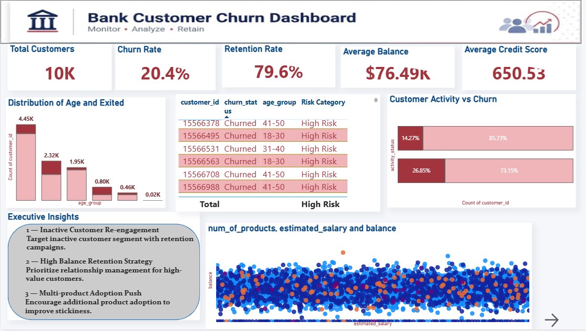
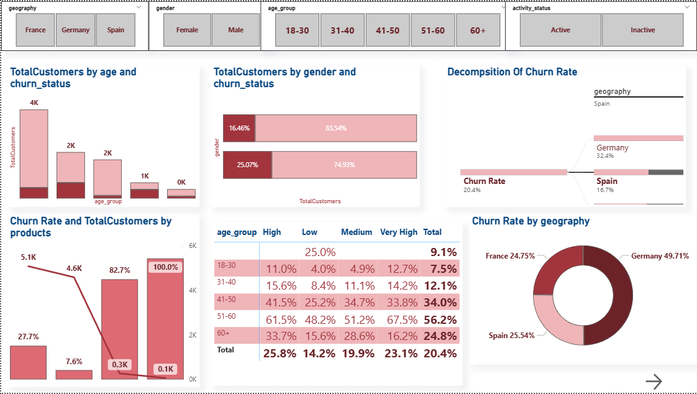
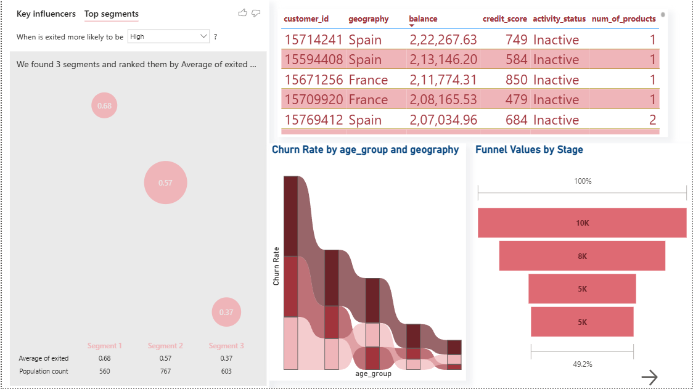
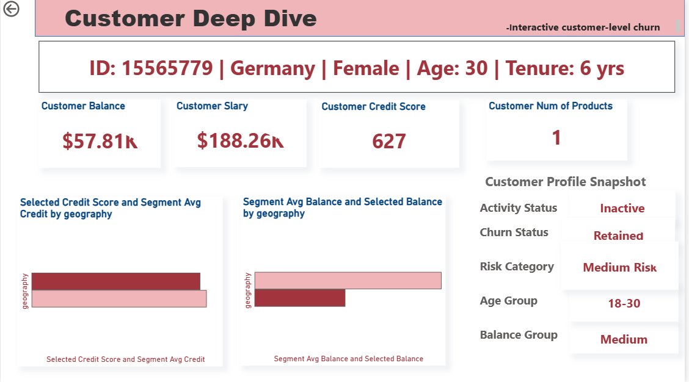

# Bank Customer Churn Analysis Dashboard

A dynamic and interactive Power BI dashboard built to analyze customer churn behavior in the banking sector—focusing on churn risk identification, customer segmentation, behavioral analysis, retention monitoring, and customer-level investigation.

---

## 📸 Dashboard Preview

<p align="center">
  
</p>

---

## 📖 Short Description / Purpose

The Bank Customer Churn Analysis Dashboard is a visually engaging and analytical Power BI report designed to help users explore and understand customer attrition patterns within a banking environment.

The dashboard focuses on highlighting customer demographics, account activity, balance behavior, churn distribution, and retention trends.

This tool is intended for:
- Business Analysts
- Banking Professionals
- Customer Retention Teams
- Data-Driven Strategists

The goal is to deliver actionable insights that improve customer retention and reduce churn risk.

---

## 🛠️ Tech Stack

The dashboard was built using the following tools and technologies:

- 📊 **Power BI Desktop** – Main data visualization platform used for report creation and dashboard development.
- 📂 **Power Query** – Data transformation and cleaning layer for preprocessing and reshaping data.
- 🧠 **DAX (Data Analysis Expressions)** – Used for calculated measures, KPIs, conditional logic, and dynamic analysis.
- 🐍 **Python (Pandas, NumPy, Matplotlib)** – Used for exploratory data analysis, preprocessing, and feature engineering.
- 🗃️ **SQL** – Used for schema creation and analytical query preparation.
- 📝 **Data Modeling** – Relationships established among tables to enable drillthroughs and cross-filtering.
- 📁 **File Formats** – `.pbix`, `.ipynb`, `.csv`, `.png`

---

## 📂 Data Source

**Source:** Bank Customer Churn Dataset

The dataset contains information for 10,000 banking customers, including:

- Customer ID
- Geography
- Gender
- Age
- Credit Score
- Balance
- Estimated Salary
- Number of Products
- Activity Status
- Churn Status

The dataset was cleaned, transformed, and enriched using Python and Power Query before integration into Power BI.

---

# 🚀 Features / Highlights

---

## • Business Problem

Customer churn is one of the biggest challenges in the banking industry, directly impacting profitability, customer acquisition costs, and long-term customer relationships.

Key questions such as:

- Which customer segments are most likely to churn?
- Do inactive customers churn more frequently?
- Which geography contributes most to churn?
- How does balance and product usage affect retention?
- Which customers represent the highest financial risk?

... are difficult to answer quickly using raw customer data alone.

---

## • Goal of the Dashboard

To deliver an interactive visual analytics tool that:

- Enables users to explore churn behavior across customer demographics and geography.
- Supports customer retention strategy and risk analysis.
- Identifies high-risk customer segments using behavioral and financial indicators.
- Provides executive-level KPIs and operational customer insights.
- Enables customer-level investigation using interactive drillthrough analytics.

---

# 📊 Walkthrough of Key Dashboard Pages

---

## 📌 Executive Summary Dashboard

### Key KPIs

- Total Customers: 10K
- Churn Rate: 20.4%
- Retention Rate: 79.6%
- Average Balance: $76.49K
- Average Credit Score: 650.53

These KPIs provide a quick overview of overall customer retention performance and financial exposure.

### Key Visuals

- Churn Rate by Balance Group
- Customer Activity vs Churn
- Customer Risk Segmentation Table
- Salary vs Balance Scatter Analysis
- Executive Insight Recommendations

### Key Insights

- Inactive customers demonstrate significantly higher churn concentration.
- High-balance customers represent elevated financial risk exposure.
- Product engagement appears correlated with stronger customer retention.

---

<p align="center">
  
</p>

---

## 📌 Customer Segmentation Analytics

### Key Visuals

- Age Group vs Churn Status
- Gender vs Churn Distribution
- Decomposition Tree Analysis
- Product Usage vs Churn Rate
- Churn Matrix by Age Group & Balance Segment
- Churn Share by Geography

### Key Insights

- Customers aged 51–60 exhibit the highest churn probability.
- Germany contributes disproportionately to churn volume.
- Multi-product customers show stronger retention behavior.

---

<p align="center">
  
</p>

---

## 📌 Advanced Churn Insights

### Key Visuals

- Key Influencers Analysis
- Top Customer Segments
- Funnel Analysis
- Geography vs Age Churn Trends
- High-Risk Customer Operational Table

### Key Insights

- Customers with low credit scores and high balances demonstrate elevated churn likelihood.
- Specific demographic-product combinations reveal concentrated churn risk.
- Funnel analysis highlights customer retention drop-off stages.

---

<p align="center">
  
</p>

---

## 📌 Customer Deep Dive Dashboard

### Key Features

- Customer Identity Strip
- Individual KPI Cards
- Customer Profile Snapshot
- Selected Customer vs Segment Comparison
- Geography-Based Analysis
- Drillthrough Navigation

### Business Value

Enables analysts and retention teams to:

- Investigate high-risk customers individually
- Compare customer behavior against segment averages
- Support targeted retention strategies

---

<p align="center">
  
</p>

---

# 📈 Business Impact & Insights

### Customer Retention Strategy

Banks can proactively identify high-risk customers and improve targeted retention campaigns.

### Financial Risk Monitoring

High-balance churn customers can be monitored to reduce financial exposure.

### Customer Segmentation

Behavioral and demographic segmentation supports personalized engagement strategies.

### Executive Decision Support

Interactive KPIs and advanced analytics provide actionable insights for management teams.

### Operational Analytics

Customer-level drillthrough investigation improves analytical decision-making and risk assessment workflows.

---

# 📁 Project Structure

```text
Bank-Customer-Churn-Analysis/
│
├── data/
│   ├── raw/
│   └── processed/
│
├── notebooks/
│   ├── data_preparation.ipynb
│   └── eda_and_insights.ipynb
│
├── powerbi/
│   └── Bank_Churn_Analysis.pbix
│
├── sql/
│   ├── schema.sql
│   └── views.sql
│
├── screenshots/
│   ├── executive_summary.png
│   ├── segmentation_analytics.png
│   ├── advanced_churn_insights.png
│   └── customer_deep_dive.png
│
├── src/
│
├── README.md
├── requirements.txt
└── .gitignore
```

---

# 🔑 Skills Demonstrated

- Data Cleaning
- Data Transformation
- Data Modeling
- DAX Calculations
- Dashboard Design
- Business Intelligence
- Customer Segmentation
- Drillthrough Analytics
- Data Storytelling
- KPI Development
- Interactive Reporting
- Churn Analysis

---

# 🔮 Future Improvements

- Predictive churn modeling using Machine Learning
- Real-time database integration
- Automated alert systems for high-risk customers
- Power BI Service deployment
- Customer retention recommendation engine
- Enhanced tooltip and drillthrough analytics

---

# 📬 Contact

If you’d like to connect or discuss the project:

- LinkedIn: *(Add your LinkedIn here)*
- GitHub: *(Add your GitHub here)*
